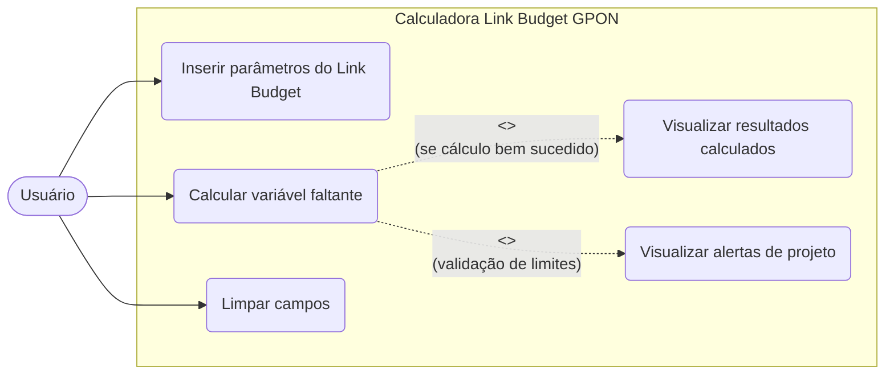
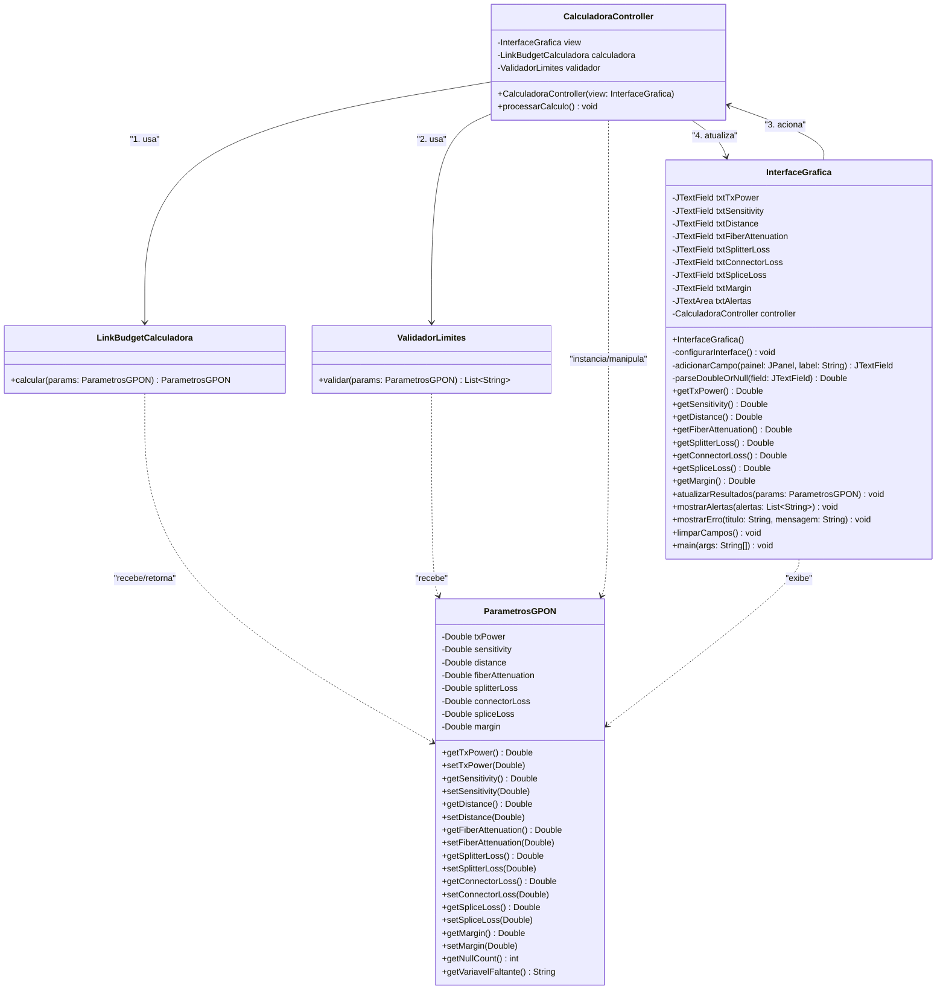

# Documento de Requisitos

Este documento contém os artefatos de requisitos solicitados para o sistema **Calculadora de Link Budget GPON**, atualizados de acordo com a implementação final do código.

## Lista de Requisitos

### Requisitos Funcionais (RF)
*   **RF1:** O sistema deve calcular qualquer variável da fórmula de Link Budget desde que as demais sejam fornecidas.
    *   *Status:* **Atendido**. A classe `LinkBudgetCalculadora` consegue isolar matematicamente e resolver a equação para qualquer um dos 8 parâmetros possíveis quando exatamente 1 é deixado em branco.
*   **RF2:** O sistema deve validar entradas com base em padrões de normas técnicas (ex: ITU-T G.984).
    *   *Status:* **Atendido**. A classe `ValidadorLimites` emite alertas se a atenuação, potência Tx, sensibilidade, distância ou margem de segurança estiverem fora dos padrões comerciais do padrão GPON (ex: Tx fora de +1.5 a +7 dBm, atenuação fora de 0.2 a 0.4 dB/km).

### Requisitos Não Funcionais (RNF)
*   **RNF1:** O diagrama de classes deve separar a interface de usuário da lógica matemática de propagação.
    *   *Status:* **Atendido**. O sistema utiliza o padrão MVC (Model-View-Controller). A view (`InterfaceGrafica`) e a lógica matemática (`LinkBudgetCalculadora`) são completamente isoladas, comunicando-se apenas através do `CalculadoraController`.

---

## 1. Diagrama de Caso de Uso

O diagrama de caso de uso descreve as interações entre o usuário (Ator) e o sistema.

### Descrição dos Casos de Uso:
*   **Inserir parâmetros do Link Budget:** O usuário preenche os campos com os valores conhecidos (Potência Tx, Sensibilidade Rx, Distância, Atenuação da Fibra, Perdas de Splitters, Conectores, Fusões e Margem de Segurança), deixando exatamente um campo em branco (que será calculado).
*   **Calcular variável faltante:** O usuário solicita o cálculo. O sistema identifica o campo vazio e aplica a fórmula correta do Link Budget.
*   **Visualizar resultados calculados:** O sistema preenche o campo que estava em branco com o resultado do cálculo.
*   **Visualizar alertas de projeto:** O sistema valida os valores (calculados ou inseridos) contra padrões típicos de GPON (ex: atenuação, distância) e exibe alertas caso algo esteja fora do comum ou represente um risco.
*   **Limpar campos:** O usuário solicita a limpeza de todos os campos de entrada e saída.

---

## 2. Diagrama de Classe

O diagrama de classe reflete a estrutura exata do código Java atual, seguindo a arquitetura MVC (Model-View-Controller) implementada.

### Arquitetura:
*   **Model (`com.gpon.model`)**: Contém as classes `ParametrosGPON` (DTO contendo as variáveis), `LinkBudgetCalculadora` (regras de negócio do cálculo) e `ValidadorLimites` (validação de regras de engenharia óptica).
*   **Controller (`com.gpon.controller`)**: O `CalculadoraController` orquestra a comunicação entre a View e os Models.
*   **View (`com.gpon.view`)**: A `InterfaceGrafica` cuida exclusivamente dos componentes Swing (Java) para interação visual com o usuário, sem conter lógica de negócios.
